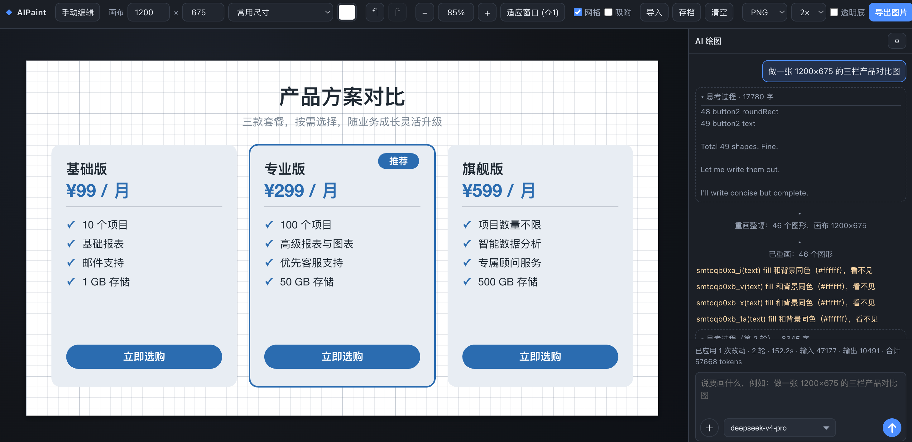
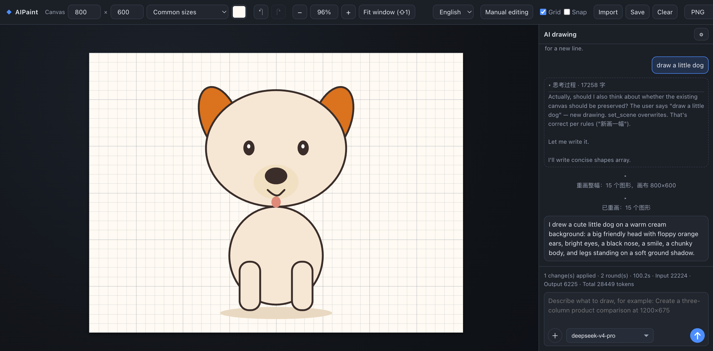

# AIPaint

[中文](README.md) · [English](README.en.md)

AIPaint is an LLM-driven structured drawing tool. Describe what you want in natural language, and the AI creates and edits structured objects on a canvas. Manual drawing is mainly used to fine-tune AI-generated results.

## How is it different from direct multimodal image generation?

AIPaint does not generate one finished pixel image. The LLM operates an editable canvas made of shapes, text, connectors, groups, notes, and image objects. You can continue editing individual objects after generation.

| Comparison | AIPaint | Direct image generation |
| --- | --- | --- |
| Output | Editable shapes, text, connectors, and images | A pixel image |
| Interaction | Continue asking the AI to modify individual objects | Usually regenerate the whole image |
| Text and layout | Text is an independent, editable object | Text may be rasterized into the image |
| Best for | Flowcharts, diagrams, product comparisons, and reusable designs | Illustrations, concept art, photos, and finished artwork |

## Features

- Generate and refine editable canvases through natural-language conversations
- Use the current canvas, selected objects, images, documents, and code files as context
- Create rectangles, rounded rectangles, ellipses, diamonds, lines, arrows, connectors, notes, groups, text, paths, and images
- Switch between Chinese and English UI languages
- Manually adjust styles, position, size, rotation, fonts, and layer order
- Attach common code files such as `.c`, `.cpp`, `.py`, `.js`, and `.ts`
- Export scenes as PNG or JPEG at 1×–4× scale
- Save scenes as JSON and import them later
- Automatically save the current scene in browser local storage

## Quick start

### Requirements

Use a recent Node.js LTS release. The project uses native Node.js `fetch`, `.env` loading, and Abort Signal APIs.

### Install and run

```bash
npm install
npm start
```

Open [http://127.0.0.1:3000](http://127.0.0.1:3000).

For development:

```bash
npm run dev
```

You can change the address and port with `HOST` and `PORT`:

```bash
PORT=8080 npm start
HOST=0.0.0.0 PORT=3000 npm start
```

## Configure AI drawing

AI drawing requires a DeepSeek API key.

### Configure it in the web UI

1. Start the project and open the page.
2. Click the gear button next to “AI drawing”.
3. Enter the API Base URL and API Key.
4. Click “Save”.

The default API Base URL is `https://api.deepseek.com`. The API key is only shown as a mask in the UI and is stored by the server in the project root `.env` file.

### Configure it with `.env`

Create `.env` in the project root:

```dotenv
DEEPSEEK_API_KEY=sk-xxxxxxxxxxxxxxxx
```

For a one-time configuration:

```bash
DEEPSEEK_API_KEY=sk-xxxxxxxxxxxxxxxx npm start
```

Common settings:

```dotenv
DEEPSEEK_MODEL=deepseek-v4-pro
DEEPSEEK_VISION_MODEL=deepseek-v4-flash-vision-exp
DEEPSEEK_BASE_URL=https://api.deepseek.com
AGENT_MAX_ROUNDS=8
AGENT_REASONING_EFFORT=medium
```

Never commit a real API key. Environment variables already present in the shell take precedence over `.env`.

## Basic usage

### Use AI drawing

Describe the desired canvas in the AI drawing panel:

```text
Create a three-column product comparison at 1200×675, with a title, three product cards, and purchase buttons at the bottom. Use a clean blue-purple color scheme.
```

Click “Send”. The AI will plan the layout and create or modify the canvas. You can then send follow-up requests such as “Increase the title size” or “Make the third card green”.

Click `＋` in the input box to attach images or files. Images can be used as canvas assets or layout references. Text, Markdown, JSON, documents, and code files can be used as AI context.

### Operation examples

#### Example 1: Generate a three-column product comparison



#### Example 2: Generate an illustration in English

Switch the language selector to English and enter:

```text
Draw a cute little dog.
```



### Draw manually

Choose a tool from the left toolbar and drag or click on the canvas:

- `V`: Select and move
- `R`: Rectangle
- `O`: Ellipse
- `D`: Diamond
- `L`: Line
- `A`: Arrow
- `P`: Freehand line
- `T`: Text
- `I`: Insert image

After selecting an object, use the right panel to adjust its fill, stroke, line width, line style, opacity, position, size, rotation, font, and layer order. Double-click a text object to edit it.

Common shortcuts:

- `Delete`: Delete selected objects
- `⌘D`: Duplicate objects
- `⌘Z` / `⇧⌘Z`: Undo / redo
- Hold Space while dragging, or use the middle mouse button: Pan the canvas
- Hold `⌘` while scrolling: Zoom
- Hold `⇧` while dragging: Keep aspect ratio

## Save and export

- Click “Save” to download the current scene as JSON
- Click “Import” to restore a scene from JSON
- Choose PNG or JPEG and an export scale, then click “Export image”
- PNG supports transparent backgrounds; JPEG does not

The browser automatically saves the current scene. Save important work as JSON as well, because clearing site data or switching browsers may remove the local copy.

## Project structure

```text
.
├── server.js              # Express entry point and image export endpoint
├── package.json            # Dependencies and npm scripts
├── public/
│   ├── index.html          # Page structure
│   ├── styles.css          # Page styles
│   └── js/                 # Browser interactions, canvas, storage, and AI panel
├── src/
│   ├── shared/             # Shared scene model and rendering logic
│   └── agent/              # AI Agent, DeepSeek communication, and API
└── test/                   # Automated tests and SSE fixtures
```

## Tests

```bash
npm test
```

Tests use local SSE fixtures to verify Agent streaming, tool calls, sessions, and API behavior.

## Security notes

- API keys are sensitive credentials. Do not put them in commits, screenshots, or public logs.
- The server listens on the local machine by default. Add access control before using `HOST=0.0.0.0`.
- Attachments are sent to the AI service. Make sure they do not contain sensitive information.
